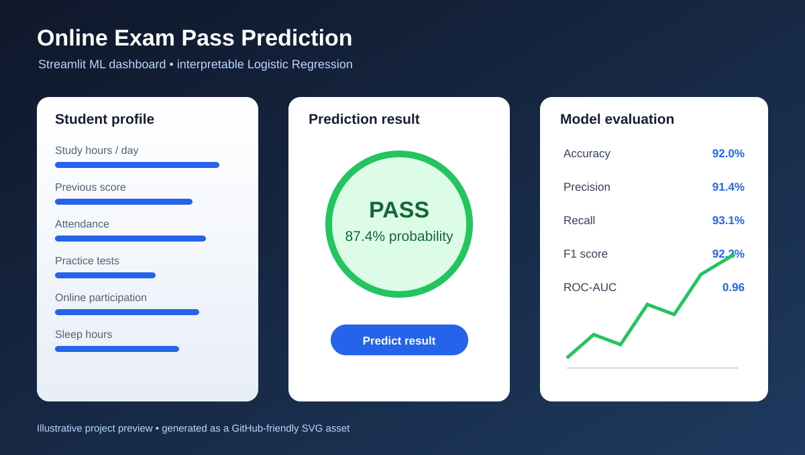
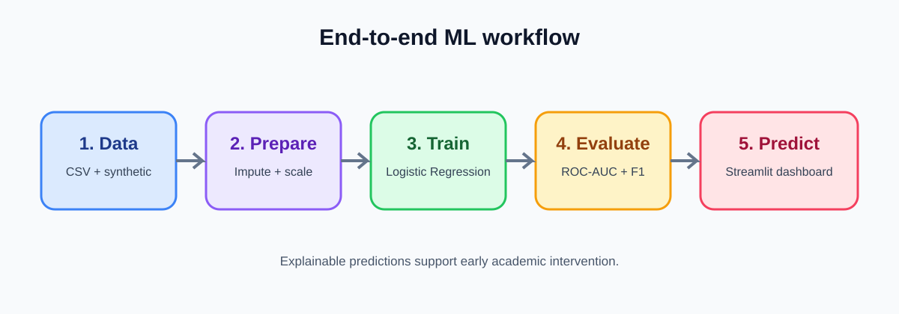

# Online Exam Pass Prediction

A production-style machine learning project that predicts whether a student is likely to pass an online exam using academic and behavioral indicators such as study hours, previous score, attendance, assignment score, practice tests, online participation, and sleep quality.

This project is built as a lightweight, interview-ready Streamlit dashboard that demonstrates an end-to-end ML workflow: dataset generation, EDA, preprocessing, Logistic Regression modeling, evaluation, feature analysis, and live prediction.

## Repository

[View project on GitHub](https://github.com/sgsinghashka-del/ONLINE-EXAM-PASS-PREDICTION-Logistic-Regression)





## Run the application

```bash
python -m venv venv
source venv/bin/activate   # Windows: venv\Scripts\activate
pip install -r requirements.txt
python scripts/train_model.py
streamlit run app.py
```

The training command creates `models/logistic_regression.pkl`. The model artifact is intentionally generated locally rather than committed to Git because binary model files are environment- and dependency-sensitive. The reproducible training script is the source of truth.

## Project structure

```text
ONLINE-EXAM-PASS-PREDICTION-Logistic-Regression/
├── app.py
├── data/online_exam_data.csv
├── models/                  # Generated model artifacts
├── scripts/train_model.py   # Reproducible model training
├── docs/assets/             # GitHub-friendly presentation visuals
├── requirements.txt
├── .gitignore
└── README.md
```

## What the dashboard demonstrates

- Binary classification with Logistic Regression
- Median missing-value handling and StandardScaler preprocessing
- Accuracy, precision, recall, F1, ROC-AUC, confusion matrix, and ROC curve
- Interpretable standardized feature coefficients
- Interactive pass/fail probability prediction

## Dataset fields

`study_hours`, `previous_score`, `attendance`, `assignment_score`, `practice_tests`, `online_participation`, `sleep_hours`, and `exam_result` (`0 = Fail`, `1 = Pass`).

## Responsible-use note

The included dataset is synthetic and intended for education and portfolio demonstration. Predictions should not be used as the sole basis for decisions about students; real deployment requires various validations, fairness testing, calibration, monitoring, and human review.
